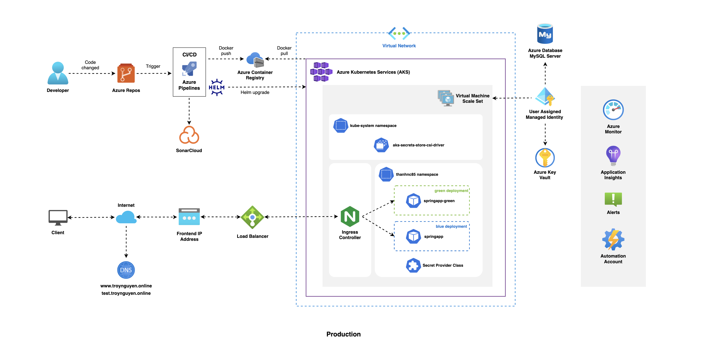

# azure-pipeline-aks-springboot

Integrate CI/CD Pipeline with **Azure Pipeline** and deploy on **Azure Kubernetes Service (AKS)** for **Spring PetClinic Sample Application**

## Azure Services Diagram

